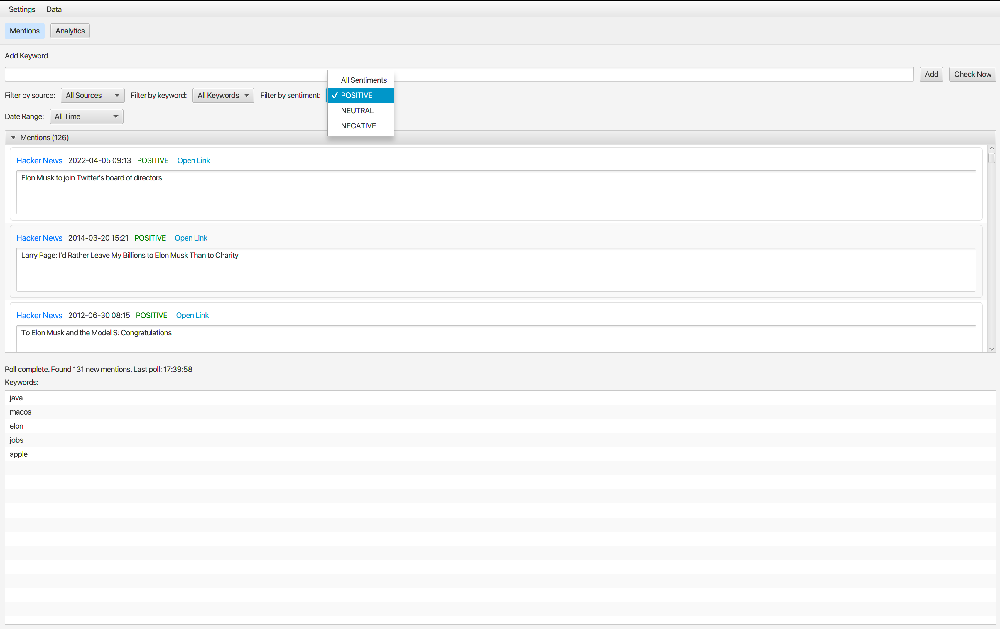
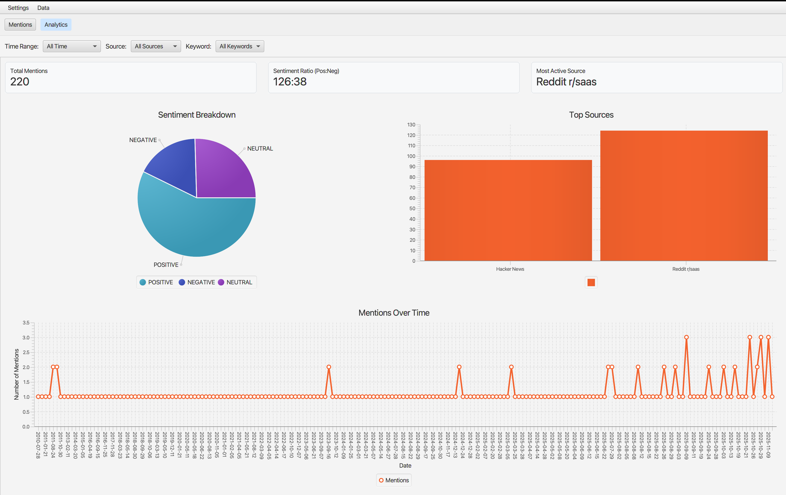

# Project Echo: Brand Monitor

**Project Echo** is a powerful, open-core brand monitoring tool designed for indie hackers, startup founders, and creators. It runs locally on your machine, respects your data, and provides actionable insights without the enterprise price tag.

### Mentions View
The main dashboard for viewing, filtering, and managing your brand mentions in real-time.


### Analytics View
An integrated analytics dashboard to visualize trends, sentiment, and top sources.


## 1. Vision & Vibe

**Vision**: To create the world's most useful brand monitor, built on a "trust-first" open-core model. We empower users to know when they're being talked about, without paying enterprise prices.

**Vibe**: "Set it and forget it." The tool is a quiet, reliable utility. It's a clean, fast, native-feeling app that respects the user's data and system resources. It's a pro tool, not a toy.

## 2. Architecture

Project Echo is a multi-module Maven project designed around an open-core model.

*   `echo-core`: A shared Java library containing the primary domain models (Keyword, Mention), service interfaces, and data source logic.
*   `echo-desktop`: A standalone, open-source JavaFX desktop application. It runs 100% locally, using a local SQLite database (`~/.project-echo/echo.db`) for storage and a background scheduler for polling.
*   `echo-server`: (Future) A premium, cloud-hosted Spring Boot backend that will provide 24/7 monitoring, a web UI, and advanced alerting features.

## 3. Getting Started

### Prerequisites

*   Java JDK 17 or higher.
*   Apache Maven 3.6.0 or higher.
*   For building native Linux packages, you may need to install `fakeroot` and `dpkg-deb`.

### Building the Project

You can compile all modules and run tests using the standard Maven command from the project root:

```sh
mvn clean install
```

## 4. Building Native Executables

The `echo-desktop` module is configured with `jpackage` to create native, self-contained executables for macOS, Windows, and Linux. This provides a seamless, "no-fuss" installation experience for end-users.

The build process is managed through Maven profiles that are **activated automatically** based on your operating system.

### To Build the Executable:

1.  **Open a terminal** in the root directory of the project (`project-echo/`).
2.  **Run the package command**:

    ```sh
    mvn clean package
    ```

    This command will build the native installer for your current OS.

### Finding the Installer

Once the build is complete, you will find the native installer in the `desktop/target/` directory.

*   **On macOS**: Look for `ProjectEcho-1.0.0.dmg`.
*   **On Windows**: Look for `ProjectEcho-1.0.0.msi`.
*   **On Linux**: Look for `projectecho_1.0.0-1_amd64.deb` (the exact filename may vary based on your architecture).

You can then run this installer just like any other native application to install Project Echo on your system.
